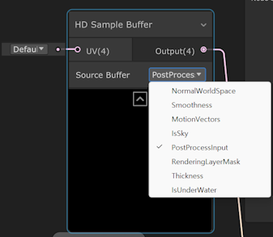

# Create and apply a custom post-processing effect

## Create a custom post-processing effect

A custom post-processing effect requires the following files:

- A C# Custom Post Process Volume.
- An associated full-screen shader. You can use a [shader file](https://docs.unity3d.com/Manual/SL-ShaderPrograms.html) or a [Fullscreen Shader Graph](fullscreen-master-stack-reference.md).

HDRP includes a template of each file you need to set up custom post-processing. To generate each template:

- C# Custom Post Process Volume: Go to **Assets** > **Create** > **Rendering** and select **HDRP C# Post Process Volume**.
- Full-screen shader: 
  - To create a shader file, go to **Assets** > **Create** > **Shader** and select **HDRP** **Post Process**.
  - To create a [Fullscreen Shader Graph](fullscreen-master-stack-reference.md), go to **Assets** > **Create** > **Shader Graph** > **HDRP** and select **Fullscreen Shader Graph**.

Note that the file name of both the C# post-process volume and the shader need to be the same to work without any modification. If the name doesn't match, you need to update the **kShaderName** property to reflect the actual name of the shader.

This creates each template file in the **Project** window in the **Assets** folder.

**Note**: When using **Full screen Shader Graph**, if you need **Scene Color**, use the **Post Process Input** source for the **HD Sample Buffer** node.



<a name="apply-custom-postprocess"></a>

## Apply a custom post-processing effect 

For HDRP to recognize a custom post-processing effect in your project, assign it in HDRP graphics settings:

1. Go to **Edit** > **Project Settings** > **Graphics** > **Pipeline Specific Settings** > **HDRP**.
2. Scroll down until you find the **Custom Post Process Orders** section. This section contains a list for each injection point.
3. In the **After Post Process** field, select **Add** (**+**).
4. Select the name of the custom post-processing you want to apply.

This also allows you to control the execution order of the post-processing effects in your scene. For more information, see [Order custom post-processing effects](custom-post-processing-create-apply.md#EffectOrdering).

To apply a custom post-processing effect in your scene, set up a volume component: 

1. Create a Volume component (Menu: **GameObject** > **Volume**).
2. Select the Volume in the Hierarchy menu.
3. In the Profile field, select the volume profile picker (circle) to add an existing volume profile, or select **New** to create a new volume profile. 
4. In the Inspector, select **Add Override.**
5. In the dropdown, search for the name of the Custom Post Process Volume script and select it.

For a full script example you can use, see [Custom post-processing example scripts](custom-post-processing-scripts.md).

## Order custom post-processing effects

HDRP allows you to customize the order of your custom post-processing effects at each stage in the rendering process. These stages are called injection points.

To determine the injection points in which your effect can appear, change the enum in the following line in the C# Custom Post Process Volume:

```c#
public override CustomPostProcessInjectionPoint injectionPoint => CustomPostProcessInjectionPoint.AfterPostProcess;
```

For more information on which enums you can use, see [CustomPostProcessInjectionPoint](https://docs.unity3d.com/Packages/com.unity.render-pipelines.high-definition@15.0/api/UnityEngine.Rendering.HighDefinition.CustomPostProcessInjectionPoint.html).

To order your custom post-processing effects:

1. Go to **Edit** > **Project Settings** > **Graphics** > **Pipeline Specific Settings** > **HDRP**.
2. Scroll down until you find the **Custom Post Process Orders** section. This section contains a field for each injection point.
3. Select the **Add** (**+**) icon to add an effect to an injection point field.

To change the order HDRP executes multiple post-processing effects within an injection point, move them up or down in this list. HDRP executes the effects in order from top to bottom.