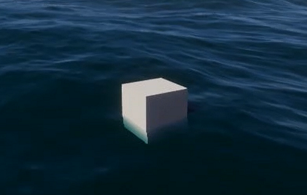
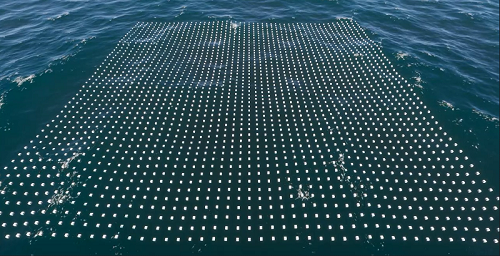

# Scripting in the Water System

## Access Water Surface height

You can add buoyancy to the water simulation with a script that queries the height of the water surface.

To do this, enable **Script Interactions** in the water surface you want to query (see [Settings and properties related to the Water System](settings-and-properties-related-to-the-water-system.md#scriptinteractions)).

The [WaterSearchParameters](https://docs.unity3d.com/Packages/com.unity.render-pipelines.high-definition@14.0/api/UnityEngine.Rendering.HighDefinition.WaterSearchParameters.html) struct makes water height queries possible.

### One object

<br/>

This is an example script to float one object on a water surface.

```
using UnityEngine;
using UnityEngine.Rendering.HighDefinition;

public class FitToWaterSurface : MonoBehaviour
{
    public WaterSurface targetSurface = null;

    // Internal search params
    WaterSearchParameters searchParameters = new WaterSearchParameters();
    WaterSearchResult searchResult = new WaterSearchResult();

    // Update is called once per frame
    void Update()
    {
        if (targetSurface != null)
        {
            // Build the search parameters
            searchParameters.startPositionWS = searchResult.candidateLocationWS;
            searchParameters.targetPositionWS = gameObject.transform.position;
            searchParameters.error = 0.01f;
            searchParameters.maxIterations = 8;

            // Do the search
            if (targetSurface.ProjectPointOnWaterSurface(searchParameters, out searchResult))
            {
                Debug.Log(searchResult.projectedPositionWS);
                gameObject.transform.position = searchResult.projectedPositionWS;
            }
            else Debug.LogError("Can't Find Projected Position");
        }
    }
}
```

### Multiple objects (with Burst)

<br/>

This is an example script to float an array of objects on a water surface using the [Burst compiler](https://docs.unity3d.com/Packages/com.unity.burst@1.8/manual/index.html).


```
using System.Collections.Generic;
using Unity.Collections;
using Unity.Jobs;
using Unity.Mathematics;
using UnityEngine;
using UnityEngine.Rendering.HighDefinition;

public class FitToWaterSurface_Burst : MonoBehaviour
{
    // Public parameters
    public int resolution = 50;
    public WaterSurface waterSurface = null;

    // List of internal cubes
    List<GameObject> cubes = new List<GameObject>();

    // Input job parameters
    NativeArray<float3> targetPositionBuffer;

    // Output job parameters
    NativeArray<float> errorBuffer;
    NativeArray<float3> candidatePositionBuffer;
    NativeArray<float3> projectedPositionWSBuffer;
    NativeArray<float3> normalWSBuffer;
    NativeArray<float3> directionBuffer;
    NativeArray<int> stepCountBuffer;

    // Start is called before the first frame update
    void Start()
    {
        // Allocate the buffers
        targetPositionBuffer = new NativeArray<float3>(resolution * resolution, Allocator.Persistent);
        errorBuffer = new NativeArray<float>(resolution * resolution, Allocator.Persistent);
        candidatePositionBuffer = new NativeArray<float3>(resolution * resolution, Allocator.Persistent);
        projectedPositionWSBuffer = new NativeArray<float3>(resolution * resolution, Allocator.Persistent);
        normalWSBuffer = new NativeArray<float3>(resolution * resolution, Allocator.Persistent);
        directionBuffer = new NativeArray<float3>(resolution * resolution, Allocator.Persistent);
        stepCountBuffer = new NativeArray<int>(resolution * resolution, Allocator.Persistent);

        for (int y = 0; y < resolution; ++y)
        {
            for (int x = 0; x < resolution; ++x)
            {
                GameObject newCube = GameObject.CreatePrimitive(PrimitiveType.Cube);
                newCube.transform.parent = this.transform;
                newCube.transform.localPosition = new Vector3(x * 5, 0.0f, y * 5);
                cubes.Add(newCube);
            }
        }
    }

    // Update is called once per frame
    void Update()
    {
        if (waterSurface == null)
            return;
        // Try to get the simulation data if available
        WaterSimSearchData simData = new WaterSimSearchData();
        if (!waterSurface.FillWaterSearchData(ref simData))
            return;

        // Fill the input positions
        int numElements = resolution * resolution;
        for (int i = 0; i < numElements; ++i)
            targetPositionBuffer[i] = cubes[i].transform.position;

        // Prepare the first band
        WaterSimulationSearchJob searchJob = new WaterSimulationSearchJob();

        // Assign the simulation data
        searchJob.simSearchData = simData;

        // Fill the input data
        searchJob.targetPositionWSBuffer = targetPositionBuffer;
        searchJob.startPositionWSBuffer = targetPositionBuffer;
        searchJob.maxIterations = 8;
        searchJob.error = 0.01f;
        searchJob.includeDeformation = true;
        searchJob.excludeSimulation = false;

        searchJob.errorBuffer = errorBuffer;
        searchJob.candidateLocationWSBuffer = candidatePositionBuffer;
        searchJob.projectedPositionWSBuffer = projectedPositionWSBuffer;
        searchJob.normalWSBuffer = normalWSBuffer;
        searchJob.directionBuffer = directionBuffer;
        searchJob.stepCountBuffer = stepCountBuffer;

        // Schedule the job with one Execute per index in the results array and only 1 item per processing batch
        JobHandle handle = searchJob.Schedule(numElements, 1);
        handle.Complete();

        // Fill the input positions
        for (int i = 0; i < numElements; ++i)
            cubes[i].transform.position = projectedPositionWSBuffer[i];
    }

    private void OnDestroy()
    {
        targetPositionBuffer.Dispose();
        errorBuffer.Dispose();
        candidatePositionBuffer.Dispose();
        projectedPositionWSBuffer.Dispose();
        normalWSBuffer.Dispose();
        directionBuffer.Dispose();
        stepCountBuffer.Dispose();
    }
}

```

## Access Water Surface normal

The normal of the water surface at a given point can be queried as an additional output when accessing height. To do this, set the following variable in the search parameter struct sent to the system.
```
searchParameters.outputNormal = true;
```

Then the result can be used, for example to align an object along the surface of the water
```
gameObject.transform.LookAt(searchResult.projectedPositionWS + searchResult.normalWS, Vector3.up);
```

When using the Burst version of the API as in the sample above, don't forget to allocate the array to store normal result.
This following script contains only the relevant lines to add to the one above to support querying normals.
```
public class FitToWaterSurface_Burst : MonoBehaviour
{
    NativeArray<float3> normalWSBuffer;

    void Start()
    {
        normalWSBuffer = new NativeArray<float3>(resolution * resolution, Allocator.Persistent);
    }

    void Update()
    {
        searchJob.outputNormal = true;
        searchJob.normalWSBuffer = normalWSBuffer;
    }

    private void OnDestroy()
    {
        normalWSBuffer.Dispose();
    }
}
```

## Add caustics

To enhance the visual fidelity of your water surfaces, you can incorporate realistic [caustics](water-caustics-in-the-water-system.md) into your scenes.

To query the caustics buffer of the water surface at a given point as an additional output, use the [GetCausticsBuffer()](../api/UnityEngine.Rendering.HighDefinition.WaterSurface.html#UnityEngine_Rendering_HighDefinition_WaterSurface_GetCausticsBuffer_System_Single__) function provided by the [WaterSurface](xref:UnityEngine.Rendering.HighDefinition.WaterSurface) class.

## Add foam

To enhance the appearance of waves, shorelines, and water turbulence, you can incorporate foam effects.

To query the foam buffer of the water surface at a given point as an additional output, use the [GetFoamBuffer()](../api/UnityEngine.Rendering.HighDefinition.WaterSurface.html#UnityEngine_Rendering_HighDefinition_WaterSurface_GetFoamBuffer_UnityEngine_Vector2__) function provided by the [WaterSurface](xref:UnityEngine.Rendering.HighDefinition.WaterSurface) class.

## Check waves and ripples

You can retrieve information about the displacement of the water surface due to waves and ripples.

To query the deformation buffer of the water surface at a given point as an additional output, use the [GetDeformationBuffer()](../api/UnityEngine.Rendering.HighDefinition.WaterSurface.html#UnityEngine_Rendering_HighDefinition_WaterSurface_GetDeformationBuffer) function provided by the [WaterSurface](xref:UnityEngine.Rendering.HighDefinition.WaterSurface) class.

## Synchronize water surfaces

When working with multiple water surfaces, it can be useful to synchronize the water simulation of each of the surface.
In a multiplayer game, this can ensure all clients have a water simulation that is running in sync.
You can achieve this by using one of the two following APIs;

```cs
water.simulationStart = DateTime.Now; // HDRP will compute the water simulation as if the game just started
water.simulationTime = 0; // Set the exact simulation time in seconds
```

Alternatively, if you have a reference water surface, you can make sure other existing surfaces are synchronized with this one by copying the simulation time value:

```cs
water.simulationStart = referenceSurface.simulationStart;
water.simulationTime = referenceSurface.simulationTime;
```

The `simulationStart` API works with absolute time data, which simplifies synchronization when sending the value over the network, as you don't have to account for the latency.
Using the `simulationTime` gives you direct access to the time value used to compute the result of the water simulation and is useful when synchronizing surfaces locally.

With this, it is also possible to synchronize multiple juxtaposed water surfaces (as if it was only one big surface). 
For the water surfaces to tile properly, the size of the water surfaces need to be an integer multiple of the repetition size and the repetition size needs to be a multiple of 10.
Example: two 50m * 50m water surfaces with a repetition size of 50 will tile properly, but two 45m * 45m with a repetition size of 45 will show a seam between the surfaces.  